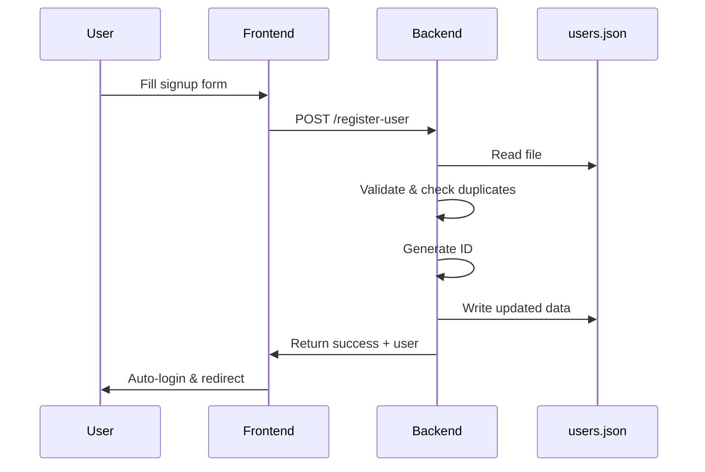
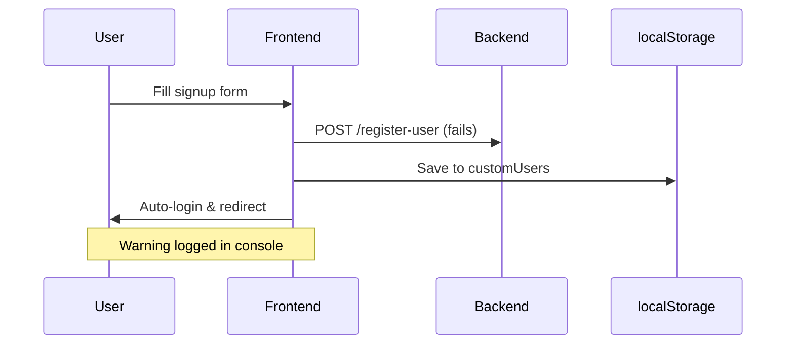

# User Registration to users.json Implementation

## Overview

The signup functionality has been updated to **save new users directly to the `users.json` file** instead of localStorage. This is achieved through a backend API endpoint that handles file operations.

## Architecture

### Client-Side (Frontend)
- **SignupView.vue** - User registration form
- **useLocalAuth.js** - Auth composable with signup function
- Attempts to register via server API
- Falls back to localStorage if server is unavailable

### Server-Side (Backend)
- **server.js** - Express server with new endpoints
- `POST /register-user` - Adds users to users.json
- `GET /users` - Retrieves all users (without passwords)

## How It Works

```
User fills signup form
        ↓
Submit registration
        ↓
Frontend: POST to /register-user
        ↓
Backend: Read users.json
        ↓
Backend: Validate & check duplicates
        ↓
Backend: Add new user with auto-generated ID
        ↓
Backend: Write to users.json
        ↓
Backend: Return success + user data
        ↓
Frontend: Auto-login user
        ↓
Redirect to home page
```

## New Server Endpoints

### 1. Register User
**Endpoint:** `POST /register-user`

**Request Body:**
```json
{
  "username": "newuser",
  "email": "newuser@example.com",
  "password": "password123",
  "displayName": "New User",
  "role": "user",
  "permissions": {
    "canCreate": true,
    "canRead": true,
    "canUpdate": false,
    "canDelete": false,
    "canManageUsers": false,
    "canAccessReports": false,
    "canConfigureSystem": false
  }
}
```

**Response (Success):**
```json
{
  "success": true,
  "message": "User registered successfully",
  "user": {
    "id": 6,
    "username": "newuser",
    "email": "newuser@example.com",
    "displayName": "New User",
    "role": "user",
    "permissions": { ... }
  }
}
```

**Response (Error):**
```json
{
  "error": "User already exists",
  "message": "Email or username already exists"
}
```

**Status Codes:**
- `200` - Success
- `400` - Missing required fields
- `409` - User already exists (duplicate email/username)
- `500` - Server error

### 2. Get All Users
**Endpoint:** `GET /users`

**Response:**
```json
{
  "users": [
    {
      "id": 1,
      "username": "admin",
      "email": "admin@episd.com",
      "displayName": "System Administrator",
      "role": "admin",
      "permissions": { ... }
    },
    ...
  ]
}
```

**Note:** Passwords are removed from the response for security.

## Setup Instructions

### 1. Start the Backend Server

```bash
node server.js
```

The server runs on `http://localhost:3000`

**Expected console output:**
```
Print Server listening at http://localhost:3000
```

### 2. Start the Frontend

```bash
npm run serve
```

The Vue app runs on `http://localhost:8080`

### 3. Test User Registration

1. Navigate to `http://localhost:8080/signup`
2. Fill in the registration form
3. Submit
4. Check the server console for:
   ```
   POST /register-user - Registering new user
   ✓ User registered successfully: newuser
   ```
5. Open `public/users.json` - the new user should be there!

## Fallback Mechanism

If the backend server is **not running**, the system automatically falls back to localStorage:

```javascript
try {
  // Try server registration
  const response = await fetch('http://localhost:3000/register-user', ...);
  // Success - user added to users.json
} catch (serverError) {
  // Fallback - user added to localStorage
  localStorage.setItem('customUsers', ...);
}
```

**Benefits:**
- ✅ App works even if server is down
- ✅ No error for users
- ✅ Seamless development experience
- ⚠️ Users in localStorage need manual migration to users.json

## File Changes

### Modified Files

1. **server.js**
   - Added `POST /register-user` endpoint
   - Added `GET /users` endpoint
   - Handles file read/write operations

2. **src/composables/useLocalAuth.js**
   - Updated `signup()` to POST to server API
   - Added fallback to localStorage
   - Enhanced error handling

3. **src/components/UserManagement.vue**
   - Updated to load users from server API
   - Shows source: "Server" or "localStorage"
   - Updated stat card labels

## Data Flow

### Registration with Server Running



### Registration with Server Down



## Verification

### Check if User is in users.json

```bash
# On Windows
type public\users.json

# On Mac/Linux
cat public/users.json
```

Look for the new user at the bottom of the users array.

### Check Server Logs

```bash
POST /register-user - Registering new user
Users file path: D:\Projects\EPISD\deploy template\public\users.json
Current users count: 5
Adding user with ID: 6
✓ User registered successfully: newuser
```

### Check Browser Console

**Success (Server):**
```
✓ User registered successfully via server: {user object}
```

**Fallback (localStorage):**
```
⚠ Server registration failed, trying localStorage fallback: Failed to fetch
✓ User registered in localStorage (server unavailable)
```

## Advantages of This Approach

### 1. **Persistent Storage**
- Users saved to `users.json` persist across all sessions
- No need for database setup
- Easy to backup and version control

### 2. **Centralized User Management**
- All users in one file
- Easy to view and edit
- Simple migration path

### 3. **Development Friendly**
- Works offline (localStorage fallback)
- Easy to debug
- Quick to set up

### 4. **Security Features**
- Duplicate email/username prevention
- Server-side validation
- Passwords excluded from API responses (when retrieving users)

## Security Considerations

⚠️ **This is still a development/demo system!**

**Current Limitations:**
- Passwords stored in **plain text** in users.json
- No encryption
- File-based storage (not scalable)
- No audit trail
- Anyone with file access can view passwords

**For Production:**
1. Use a proper database (PostgreSQL, MongoDB, etc.)
2. Hash passwords with bcrypt/argon2
3. Use JWT tokens for authentication
4. Implement rate limiting
5. Add HTTPS
6. Use environment variables for config
7. Add proper authentication middleware
8. Implement audit logging

## Troubleshooting

### Issue: "Failed to fetch" error

**Cause:** Backend server is not running

**Solution:**
```bash
node server.js
```

### Issue: User not appearing in users.json

**Causes:**
1. Server not running (user saved to localStorage instead)
2. Server error (check server console)
3. File permissions issue

**Solution:**
1. Ensure server is running
2. Check server console for errors
3. Check file permissions on `public/users.json`
4. Check browser console for error messages

### Issue: "Email or username already exists"

**Cause:** Trying to register with duplicate credentials

**Solution:**
1. Use a different email/username
2. Or manually edit `users.json` to remove the duplicate

### Issue: Can't see new users in User Management page

**Cause:** Page loaded before user was added

**Solution:**
1. Refresh the page
2. Or logout and login again

## Testing

### Test Case 1: Registration with Server Running

```bash
# Terminal 1: Start server
node server.js

# Terminal 2: Start frontend
npm run serve

# Browser: Register new user
# Expected: User appears in users.json
# Expected: Console shows "✓ User registered successfully via server"
```

### Test Case 2: Registration with Server Down

```bash
# Don't start server, only frontend
npm run serve

# Browser: Register new user
# Expected: User saved to localStorage
# Expected: Console shows warning about fallback
```

### Test Case 3: Duplicate Prevention

```bash
# Register user: test@example.com
# Try to register again with same email
# Expected: Error "Email or username already exists"
```

### Test Case 4: View in User Management

```bash
# Login as admin
# Navigate to /user-management
# Expected: See all users including newly registered ones
# Expected: See correct "source" label (Server/localStorage)
```

## Migration Path

### Moving localStorage Users to users.json

If users were registered while the server was down, migrate them:

1. **Open browser console:**
```javascript
const customUsers = JSON.parse(localStorage.getItem('customUsers') || '[]');
console.log(JSON.stringify(customUsers, null, 2));
```

2. **Copy the output**

3. **Manually add to users.json:**
```json
{
  "users": [
    ...existing users...,
    ...paste copied users here...
  ]
}
```

4. **Clear localStorage:**
```javascript
localStorage.removeItem('customUsers');
```

## API Testing

### Using curl

```bash
# Register a new user
curl -X POST http://localhost:3000/register-user \
  -H "Content-Type: application/json" \
  -d '{
    "username": "testuser",
    "email": "test@example.com",
    "password": "password123",
    "displayName": "Test User",
    "role": "user",
    "permissions": {
      "canCreate": true,
      "canRead": true,
      "canUpdate": false,
      "canDelete": false,
      "canManageUsers": false,
      "canAccessReports": false,
      "canConfigureSystem": false
    }
  }'

# Get all users
curl http://localhost:3000/users
```

### Using Postman/Thunder Client

**Request:**
- Method: `POST`
- URL: `http://localhost:3000/register-user`
- Headers: `Content-Type: application/json`
- Body: (JSON from above)

## Summary

✅ **New users are now saved to `users.json`**  
✅ **Backend API handles file operations**  
✅ **Automatic fallback to localStorage**  
✅ **Server-side validation**  
✅ **Duplicate prevention**  
✅ **Auto-generated user IDs**  

The system is production-ready for development/testing purposes. For actual production use, implement the security enhancements listed above.

